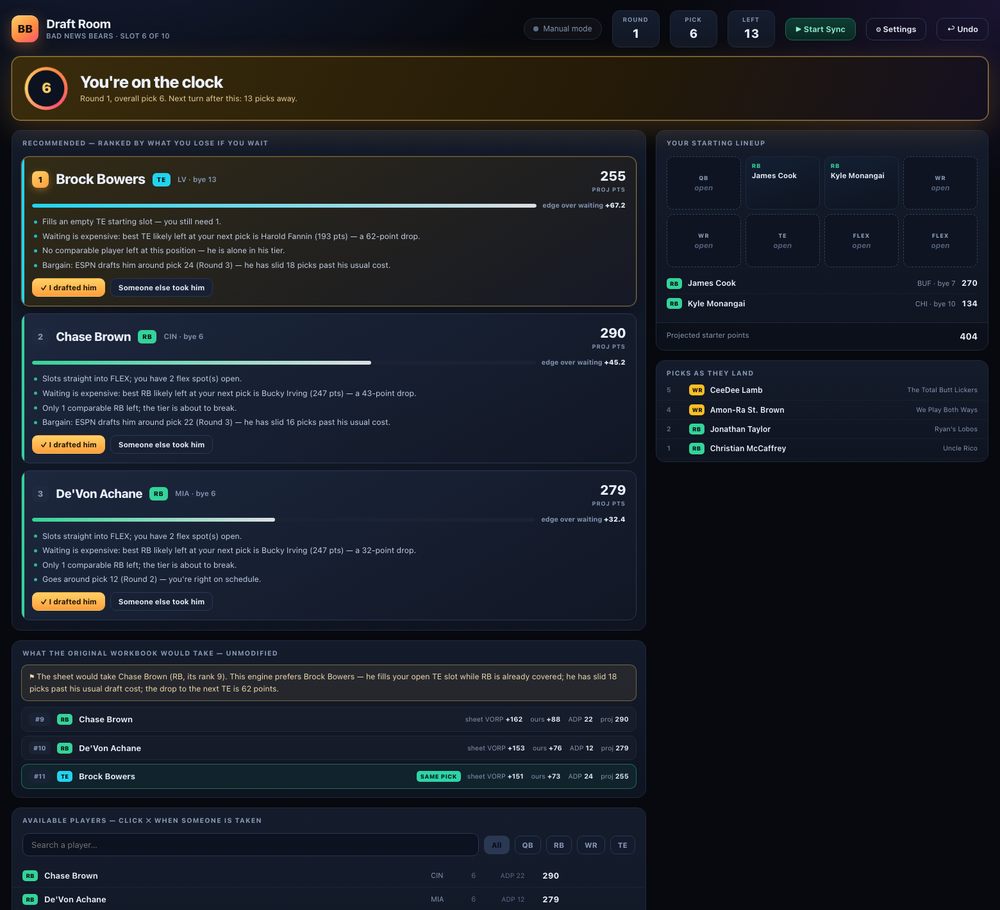

# Draft Room

A live draft assistant for ESPN fantasy football that runs entirely on your own
machine. It reads your real draft as it happens, and every time you're on the
clock it tells you the three best players available — and why.



It is built around one idea: **a player is only worth taking now if he beats the
best player you could still get at that position at your next pick.** Raw
projected points will happily tell you to draft a fifth receiver. Value over next
available won't.

## What makes it different from a printed cheat sheet

- **It knows your scoring.** Projections are rescored to your exact rules, so a
  full-PPR league values receptions like a full-PPR league.
- **It knows your roster.** Recommendations weight what you still have to start,
  not just who is best in the abstract.
- **It knows your schedule.** In a snake draft your next pick may be 9 or 19
  picks away. That gap changes the answer, and it's in the maths.
- **It knows keepers.** Kept players leave the pool from pick 1, and each
  keeper's designated round is skipped in the pick counter.
- **It uses real draft data.** ESPN publishes average draft position publicly.
  Availability is modelled from measured behaviour rather than an assumption
  about how your rivals think.
- **It shows its work.** Every recommendation carries two to four specific,
  numeric reasons, and a side panel shows what the unmodified source rankings
  would have taken so you can see exactly where the engine disagrees.

## Setup

Requires Python 3.9+ and `openpyxl`. `certifi` is strongly recommended — many
Python builds ship without a usable certificate store and HTTPS calls will fail
without it.

```bash
pip3 install openpyxl certifi
```

1. **Describe your league** — edit the `LEAGUE`, `KEEPERS` and `SLOTS` blocks at
   the top of `build_data.py`.
2. **Point it at your projections** — set `WORKBOOK` to your own projection
   spreadsheet. The parser expects per-position sheets with columns for passing,
   rushing and receiving volume. Adapt `read_workbook()` for a different source.
3. **Build the data** — `python3 build_data.py` writes `data.json`.
4. **Run it** — `python3 server.py`, or double-click `Start Draft Room.command`
   on macOS. Your browser opens on `127.0.0.1:8777`.

## Two ways to feed it picks

**Manual** works with no configuration. Click `✕ taken` as each player goes, or
type a name and press <kbd>Enter</kbd> (<kbd>Shift</kbd>+<kbd>Enter</kbd> if you
drafted him). It infers which team picked from the snake order.

**ESPN sync** pulls the real draft every 20 seconds, tightening to 6 seconds when
you're within two picks of your turn. It calls ESPN's data API directly, so you
do *not* need the draft page open. Private leagues need two cookies (`espn_s2`
and `SWID`) which you paste into the Settings panel; they're stored in a
gitignored `config.json`, chmod 600, and never leave your machine.

A failed sync never blocks you — manual clicking keeps working, and the status
pill tells you precisely what went wrong (`401` = cookies expired, `404` = wrong
league ID, and so on).

## Practice mode

Click **🎲 Practice** for a full mock draft before the real thing. The other
teams draft on ADP plus roster need with enough noise that no two mocks are
identical, pausing whenever you're on the clock and never picking for you. Skip
ahead to your turn, pause the rivals, or reset and run it again.

Across 30 simulated drafts of a 10-team league, all 300 resulting rosters were
legal and startable, the average shape was QB 1.9 / RB 4.9 / WR 6.3 / TE 1.9, and
top-50 ADP players went within about 7 picks of their average position — close
enough to a real room to be worth practising against.

## How a recommendation is scored

Start with **value over next available**: the points a player adds to your
optimal starting lineup, minus what the best remaining player at his position
would add at your next pick. Then four adjustments:

| Adjustment | Why |
|---|---|
| Positional need | Filling an empty starting slot counts fully; bench depth is discounted |
| Market slip | A player who has slid past his ADP is a bargain — capped, and halved at positions you've already filled |
| Quarterback timing | A per-pick view can't see that an early QB costs you a scarce starter all draft |
| Bye weeks | A small penalty for stacking a week you're already thin on |

Replacement level is the last *startable* player at each position, recomputed
after keepers leave and the remaining league-wide starter demand is re-derived.
This matters more than it sounds: in a one-quarterback league the tenth-best QB
is nearly as good as the second-best, so a quarterback's raw total badly
overstates his real edge. Ranking by raw points puts QBs at the top of the board
all draft long and produces genuinely bad advice.

## Caveats worth knowing

- ESPN's fantasy API is **undocumented**. It has been stable for years, but it is
  not a contract and can change without notice. Manual mode is the fallback.
- ESPN lists **duplicate player names**. Matching is keyed on name *and*
  position, keeping the most-owned record — otherwise a star can be mistaken for
  a same-named practice-squad player and ranked as a late-round flier.
- ADP is an **average across all formats**, so it under-reflects scarcity created
  by your league's specific keepers or roster rules. The engine's own value
  numbers are what handle that; ADP informs availability.
- Projections are only as good as their source. The app makes a source's opinion
  usable; it does not make it correct.

## Files

| File | Purpose |
|---|---|
| `build_data.py` | the whole data pipeline: rescore, replacement levels, ADP fetch |
| `engine.py` | recommendation logic and the explanations |
| `server.py` | local server, ESPN sync, draft state, practice mode |
| `index.html` | the interface |
| `APP-GUIDE.md` | day-of operating guide |

`data.json` and `config.json` are deliberately gitignored — the first is derived
from a paid projection product, the second holds live session cookies.

## Licence

MIT for the code. The projection data it consumes is not included and remains the
property of whoever produced it.
